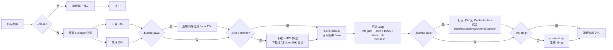

# HMCL macOS Builder

将 [HMCL (Hello Minecraft! Launcher)](https://github.com/HMCL-dev/HMCL) 打包为原生 macOS `.app` 应用捆绑包，并可选生成 `.dmg` 磁盘映像的命令行工具。

## 功能特性

### 核心打包功能
- **自动获取 HMCL**：从 GitHub Releases API 自动获取最新稳定版 HMCL JAR 包，支持通过 `--tag` 指定特定版本
- **本地 JAR 支持**：通过 `--jar` 指定本地 JAR 文件，跳过 GitHub 下载；自动从文件名（如 `HMCL-3.5.7.jar`）提取版本号
- **智能 JAR 过滤**：GitHub API 查询时自动排除 `-sources`、`-javadoc`、`-doc` 等非运行用 JAR 包
- **完整 .app 组装**：生成标准 macOS 应用包结构（`Info.plist`、`MacOS/`、`Resources/`），符合 macOS 打包规范
- **可选 DMG 生成**：自动调用 `create-dmg` 生成磁盘映像，包含应用图标和拖拽安装链接，DMG 文件名自动追加 Java 版本和架构信息

### 图标处理（`src/icon.cpp`）
- **自动下载图标**：从 HMCL 官方仓库下载 macOS 版 PNG 图标
- **多引擎转换链**：依次尝试 ImageMagick 7（`magick convert`）、ImageMagick 6（`convert`）、macOS 内置 `sips`，保证最大兼容性
- **完整 ICNS 生成**：使用 `sips` 生成 9 种标准 macOS 图标尺寸（16×16、16×32@2x、32×32、32×64@2x、64×64、128×128、256×256、512×512、1024×1024），经 `iconutil` 编译为标准 `.icns` 文件
- **容错设计**：图标处理失败仅输出警告，不影响打包流程

### Java 智能检测与打包（`src/javabundle.cpp`）
- **五层回退检测策略**：
  1. 用户通过 `--java-path` 明确指定的路径
  2. `$JAVA_HOME` 环境变量
  3. macOS `/usr/libexec/java_home` 命令
  4. 扫描 `/Library/Java/JavaVirtualMachines` 和 `~/Library/Java/JavaVirtualMachines`，自动选取版本最高的 JDK
  5. 跟踪 `/usr/bin/java` 符号链接到实际 JDK
- **版本门控**：仅检测 Java 17+，低于 17 的版本自动跳过
- **架构检测**：使用 `lipo -archs` 检测 Java 二进制架构（arm64 / x86_64），用于 DMG 命名标识
- **智能打包**：复制 Java 运行时到 `.app/Contents/Java/`，跳过运行非必需内容（`man`、`include`、`jmods`、`demo`、`sample`、`src.zip`），保留符号链接

### 启动脚本（`src/launcher.cpp`）
- **运行时语言自适应**：启动时自动检测 `$LANG` 环境变量，回退 macOS 系统偏好设置，最终默认为英文
- **中英双语错误弹窗**：通过 `osascript` 显示 macOS 原生对话框，覆盖三种异常场景——
  - JAR 主程序缺失（应用损坏）
  - Java 运行环境丢失（捆绑版或系统版）
  - 启动后 5 秒内异常退出（含退出码和日志路径提示）
- **5 秒崩溃检测**：后台启动 Java 进程，等待 5 秒后检查进程存活状态；若进程已退出且退出码非零，自动弹出错误提示
- **日志记录**：将 HMCL 运行日志输出到 `~/Library/Logs/{AppName}/launcher.log`

### 构建元数据嵌入
- 在 `Info.plist` 和 `launch.sh` 中嵌入完整的构建环境信息：
  - 工具版本、名称、仓库地址
  - 构建日期和时间
  - 构建时使用的命令行参数
  - macOS 系统版本、构建号、硬件架构（arm64 / x86_64）
  - C++ 编译器版本、CMake 版本、Xcode 版本
  - 打包的 Java 版本、架构、路径
  - create-dmg 工具版本

### 网络与代理（`src/network.cpp`）
- **libcurl 异步下载**：JAR 下载与图标处理通过 `std::async` 并行执行，大幅缩短构建时间
- **代理支持**：`--proxy` 参数为 GitHub 文件下载添加代理前缀（如 `https://gh-proxy.org/`），仅对 `github.com` 和 `githubusercontent.com` 域名生效，API 请求不使用代理
- **60 秒超时**：API 请求超时 60 秒，文件下载超时 120 秒
- **状态码验证**：下载完成后验证 HTTP 状态码为 200，失败自动清理残文件

### 工具与安全（`src/utils.cpp`）
- **RAII 临时目录**：`TempDir` 类使用 `mkdtemp` 创建唯一临时目录，析构时自动清理；`--keep-temp` 可保留临时文件用于调试
- **Shell 注入防护**：`EscapeShellArg` 函数转义 `"`、`\`、`` ` ``、`$` 特殊字符，防止命令注入
- **灵活的命令执行**：`RunCommand`（`system()` 封装，支持静默模式）和 `RunCommandCapture`（`popen` 封装，捕获输出）双模式

### 开源协议自动包含
- **HMCL 协议（必需）**：自动从 [HMCL 官方仓库](https://github.com/HMCL-dev/HMCL) 下载 GPL-3.0 协议文本，放入 `.app/Contents/Resources/licenses/HMCL-LICENSE`
- **OpenJDK 协议（可选）**：使用 `--bundle-java` 时，自动从本地 `$JAVA_HOME/LICENSE` 复制 OpenJDK 的 GPLv2+CE 协议；本地不存在时从 [openjdk/jdk](https://github.com/openjdk/jdk) 仓库下载。协议文件位于 `.app/Contents/Resources/licenses/OPENJDK-LICENSE`
- **跳过选项**：通过 `--skip-licenses` 可完全跳过协议下载与包含
- **代理支持**：协议下载使用 `--proxy` 参数，与 JAR/图标下载共用代理配置

### 清理功能
- `--clean` 选项自动删除输出目录中的 `.app` 文件夹和所有 `.dmg` 文件

## 环境要求

### 构建依赖

| 依赖 | 说明 |
|---|---|
| CMake >= 3.15 | 构建系统 |
| C++17 编译器 | Apple Clang（Xcode Command Line Tools） |
| libcurl | HTTP/HTTPS 网络请求（macOS 自带，无需额外安装） |
| nlohmann/json v3.11.3 | JSON 解析（CMake 构建时自动从 GitHub 下载到 `build/nlohmann/json.hpp`） |

### 运行依赖

| 依赖 | 说明 | 安装方式 |
|---|---|---|
| `sips` + `iconutil` | macOS 内置，用于图标缩放和 ICNS 编译 | 无需安装 |
| `create-dmg` | 可选，创建 `.dmg` 磁盘映像 | `brew install create-dmg` |
| ImageMagick | 可选，ICO→PNG 转换的首选方案 | `brew install imagemagick` |
| Java Runtime | 未使用 `--bundle-java` 时，运行 HMCL 需要系统 Java | 从 [Adoptium](https://adoptium.net) 或 [Oracle](https://java.com) 安装 |
| Java 17+ | 使用 `--bundle-java` 时，构建工具自动检测并打包本机 JDK | 无需用户额外安装 |

> 注意：本工具**仅在 macOS 上运行**，生成的 `.app` / `.dmg` 也仅适用于 macOS。

## 构建

```bash
# 1. 配置（Release 模式）
cmake -B build -DCMAKE_BUILD_TYPE=Release

# 2. 编译
cmake --build build

# 3. 编译产物位于 build/hmcl-mac-builder
```

构建过程会：
- 自动下载 nlohmann/json 单头文件库到 `build/nlohmann/`
- 从 `src/version.h.in` 模板生成 `build/version.h`（替换 `@VAR@` 占位符）
- 生成 `build/compile_commands.json` 编译数据库（可用于 IDE 代码补全）

## 使用方法

```bash
# 查看帮助
./build/hmcl-mac-builder --help

# 基本用法：下载最新 HMCL，生成 .app + .dmg 到 ./output/
./build/hmcl-mac-builder

# 使用本地 JAR，跳过 DMG 生成，保留临时文件
./build/hmcl-mac-builder --jar /path/to/HMCL.jar --no-dmg --keep-temp

# 指定应用名称和输出目录
./build/hmcl-mac-builder --app-name "MyHMCL" --output ~/Desktop

# 指定 GitHub Release 标签（如 v3.5.3）
./build/hmcl-mac-builder --tag v3.5.3

# 跳过图标处理
./build/hmcl-mac-builder --skip-icon

# 跳过开源协议下载与包含
./build/hmcl-mac-builder --skip-licenses

# 使用 GitHub 下载代理（仅对文件下载生效，API 请求不使用）
./build/hmcl-mac-builder --proxy https://gh-proxy.org/

# 启用详细日志输出
./build/hmcl-mac-builder --verbose

# 清理之前构建的文件
./build/hmcl-mac-builder --clean

# 指定输出语言（默认自动检测 LANG 环境变量）
./build/hmcl-mac-builder --lang zh
./build/hmcl-mac-builder --lang en

# 自动检测本机 Java 17+ 并打包进 .app（生成的应用自带 Java 运行环境）
./build/hmcl-mac-builder --bundle-java

# 指定要打包的 Java 安装路径（隐含 --bundle-java）
./build/hmcl-mac-builder --java-path /Library/Java/JavaVirtualMachines/jdk-21.jdk/Contents/Home

# 完整构建：打包 Java + 跳过 DMG + 详细日志 + 保留临时文件
./build/hmcl-mac-builder --bundle-java --no-dmg --verbose --keep-temp

# 使用代理 + 指定版本 + 输出到桌面
./build/hmcl-mac-builder --proxy https://gh-proxy.org/ --tag v3.5.7 --output ~/Desktop
```

## macOS 提示"已损坏 / 不安全"

打开生成的 `.app` 时，macOS 可能提示"已损坏，无法打开"或"来自身份不明的开发者"。这是因为 macOS 给从网络下载的应用添加了隔离属性（`com.apple.quarantine`）。移除隔离属性即可正常打开：

```bash
xattr -rd com.apple.quarantine /Applications/HMCL.app
```

如果仍需以 Gatekeeper 豁免，也可在"系统设置 → 隐私与安全性"中点击"仍要打开"。

## 更新 HMCL

HMCL 支持应用内自动更新。打开应用后，HMCL 会自动检查更新并下载新版 JAR 到
`~/Library/Application Support/hmcl/`，无需重新执行本工具或重装整个 `.app`。

如需手动替换，也可将新版 `HMCL-x.y.z.jar` 直接覆盖到 `.app` 内：

```bash
cp HMCL-x.y.z.jar /Applications/HMCL.app/Contents/Resources/HMCL.jar
```

启动脚本会自动使用最新的 JAR 文件。

## 命令行选项

| 选项 | 说明 | 默认值 |
|---|---|---|
| `-h, --help` | 显示帮助信息 | - |
| `-v, --version` | 显示版本号 | - |
| `-o, --output DIR` | 输出目录（存放生成的 `.app` 和 `.dmg`） | `./output` |
| `--app-name NAME` | 应用名称，将用作 `.app` 文件夹名、Info.plist 中的 CFBundleName、JAR 文件名等 | `HMCL` |
| `--jar PATH` | 指定本地 JAR 文件路径。启用后跳过 GitHub 下载、API 查询和 JAR 下载步骤；自动从 `HMCL-x.y.z.jar` 格式的文件名提取版本号 | 从 GitHub 下载最新版 |
| `--tag VERSION` | 指定 HMCL GitHub Release 标签（如 `v3.5.3`）。不指定时获取最新稳定版 | 最新稳定版 |
| `--no-dmg` | 仅生成 `.app`，跳过调用 `create-dmg` 创建磁盘映像 | 生成 `.dmg` |
| `--bundle-java` | 自动检测本机 Java 17+ 运行时并打包到 `.app/Contents/Java/`。检测策略依次为：用户指定路径 → `$JAVA_HOME` → `/usr/libexec/java_home` → 扫描 `/Library/Java/JavaVirtualMachines` 选最高版本 → 跟踪 `/usr/bin/java` 符号链接 | 不打包 |
| `--java-path PATH` | 指定要打包的 Java 安装路径（隐含 `--bundle-java`）。支持标准 JDK 目录（`bin/java`）和 macOS `.jdk` 包结构（`Contents/Home/bin/java`） | 自动检测 |
| `--skip-icon` | 跳过图标下载、PNG 转换和 ICNS 生成步骤。生成的 `.app` 将使用 macOS 默认图标 | 处理图标 |
| `--skip-licenses` | 跳过开源协议（HMCL-LICENSE、OPENJDK-LICENSE）的下载与包含。生成的 `.app` 中不包含 `Resources/licenses/` 目录 | 自动下载 HMCL 协议；`--bundle-java` 时自动包含 OpenJDK 协议 |
| `--clean` | 清理之前构建的 `.app` 文件夹和所有 `.dmg` 文件后立即退出，不执行构建 | 不清除 |
| `--proxy URL` | GitHub 下载代理前缀。仅对文件下载 URL 中包含 `github.com` 或 `githubusercontent.com` 的请求生效，API 查询请求不使用代理 | 不使用 |
| `--keep-temp` | 构建完成后保留 `/tmp/hmcl-build-XXXXXX` 临时目录中的中间文件（JAR、PNG、iconset 等），便于调试 | 自动删除 |
| `--lang zh\|en` | 输出语言（`zh` = 中文，`en` = 英文）。自动检测逻辑：读取 `$LANG` 环境变量，若以 `zh` 开头则使用中文，否则使用英文 | 自动检测 `LANG` 环境变量 |
| `--verbose` | 启用详细日志输出。显示每个步骤的具体命令执行、文件复制路径、临时目录操作等青色 `[VERBOSE]` 日志 | 仅显示 INFO/WARNING/ERROR |

## 工作原理



> **并行执行**：下载 JAR 与处理图标通过 `std::async` 并发执行，缩短总构建时间。
>
> **容错机制**：图标处理失败仅告警，不阻塞打包流程；JAR 下载失败或 Java 检测失败则终止构建并报错。
>
> **调试建议**：使用 `--verbose` 查看详细过程日志，使用 `--keep-temp` 保留临时文件排查问题。

## 项目结构

```
hmcl-mac-builder/
├── CMakeLists.txt              # CMake 构建配置：C++17、libcurl、nlohmann/json 自动下载
├── .gitignore                  # Git 忽略规则（build/、output/、*.dmg 等）
└── src/
    ├── main.cpp                # 入口，编排 11 阶段构建流水线（解析参数→下载→协议→打包→清理）
    ├── config.h / config.cpp   # Config/BuildInfo 结构体、18 个 CLI 参数解析、--help/--version
    ├── i18n.h / i18n.cpp       # 国际化：中英双语字符串表、LANG 自动检测、ANSI 彩色日志宏
    ├── utils.h / utils.cpp     # 工具函数：RunCommand、RunCommandCapture、Which、WriteFile、
    │                           #   ReadFile、Trim、CaptureOutput、ExtractVersionFromJarName、
    │                           #   EscapeShellArg、TempDir（RAII 临时目录）
    ├── version.h.in            # CMake configure_file 模板，生成版本宏（@VAR@ → 实际值）
    ├── network.h / network.cpp # libcurl HTTP GET、文件下载、代理支持、GitHub API Release 查询、
    │                           #   JAR 资产过滤、图标 URL 提供
    ├── icon.h / icon.cpp       # 图标下载、多引擎 PNG 转换（magick/convert/sips）、
    │                           #   9 尺寸 iconset 生成、iconutil ICNS 编译
    ├── launcher.h / launcher.cpp # launch.sh 生成：构建元信息注释头、LANG 检测、
    │                             #   osascript 三语错误弹窗、崩溃检测、日志重定向
    ├── javabundle.h / javabundle.cpp # Java 五层检测、版本/架构解析、智能打包（跳过非必需目录）
    ├── license.h / license.cpp       # 开源协议下载：HMCL GPL-3.0（GitHub）、OpenJDK GPLv2+CE（本地/GitHub）
    ├── appbundle.h / appbundle.cpp   # .app 目录创建、Info.plist 写入（含自定义字段）、
    │                                 #   JAR/ICNS/launch.sh 复制、触发 Java 打包
    └── dmg.h / dmg.cpp         # create-dmg 调用：窗口布局（660x400）、图标和拖拽链接坐标、DMG 命名
```

每个源文件职责明确，模块间松耦合。构建的 `.app` 目录结构如下：

```
YourApp.app/
└── Contents/
    ├── Info.plist          # 应用元信息（标准字段 + HMCLMacBuilder 自定义字段）
    ├── MacOS/
    │   └── launch.sh       # 启动脚本（可执行，含崩溃检测 + 双语错误弹窗）
    ├── Resources/
    │   ├── YourApp.jar         # HMCL 主程序
    │   ├── YourApp.icns        # macOS 应用图标
    │   └── licenses/           # 开源协议文件（仅 --skip-licenses 时不存在）
    │       ├── HMCL-LICENSE           # GPL-3.0，始终包含
    │       └── OPENJDK-LICENSE        # GPLv2+CE，仅 --bundle-java 时包含
    └── Java/                   # （仅 --bundle-java 时存在）
        ├── bin/
        │   └── java            # 捆绑的 Java 运行时
        ├── lib/
        └── ...
```

## 许可

MIT License。详见 [LICENSE](./LICENSE) 文件。
